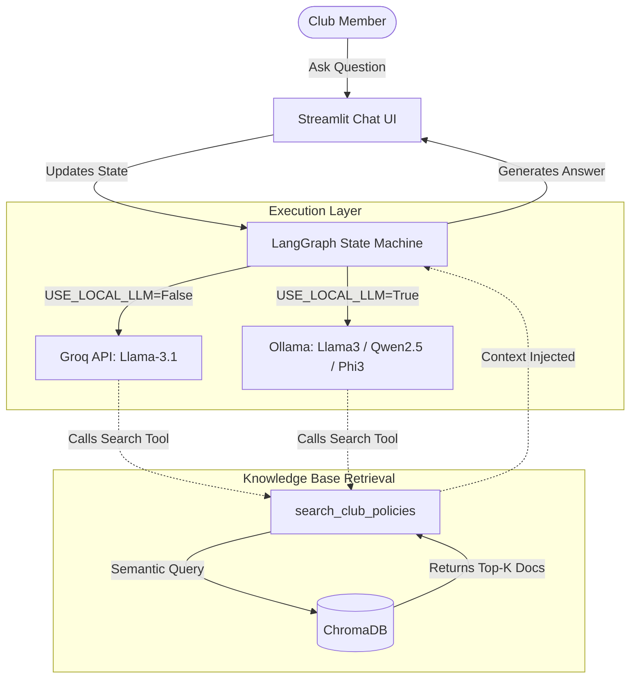
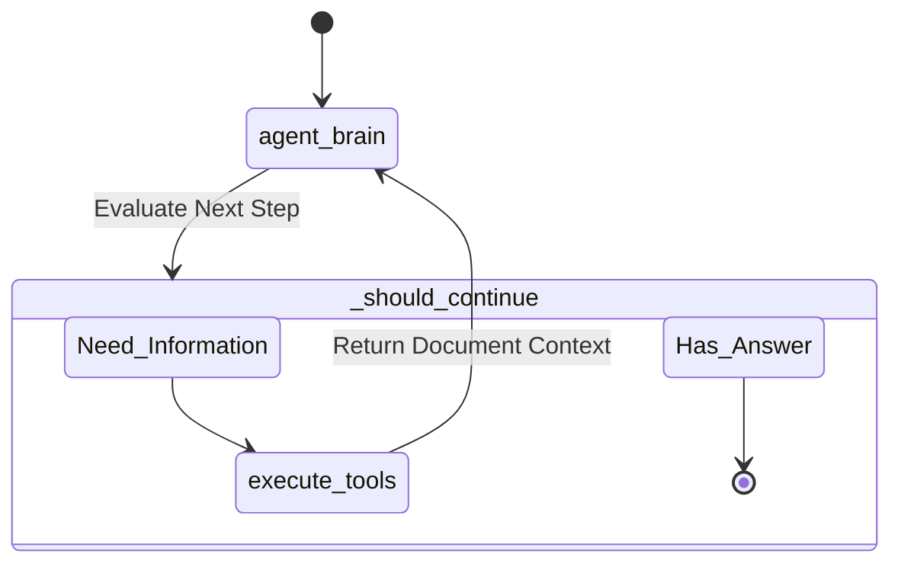

# 🚀 SRM Insiders Agentic RAG System

> **An intelligent, stateful Retrieval-Augmented Generation (RAG) assistant for the SRM Insiders Club.**

The **SRM Insiders Agent** is an advanced AI assistant designed to provide club members with precise, factual answers regarding club policies, roles, and deadlines. Built with LangGraph, it queries a centralized database of official club manuals to guarantee accurate and hallucination-free responses.

## ✨ Key Features
- **Strict Factual Accuracy:** Utilizes local vector search (ChromaDB) to retrieve exact context from club manuals before answering.
- **Dual Deployment Architecture:**
  - **☁️ Cloud Mode (Groq):** Lightning-fast inference via `llama-3.1-8b-instant`, optimized for scalable deployment on Streamlit Community Cloud.
  - **💻 Local Mode (Ollama):** 100% offline local inference for maximum privacy, utilizing `llama3` with automated fallbacks to `qwen2.5` and `phi3`.
- **Stateful Memory:** Maintains conversational context using LangGraph's state machine to handle complex, multi-turn follow-up questions.
- **Modern UI:** Clean, interactive chat interface built on Streamlit.

---

## 📊 System Architecture & Workflows

### High-Level System Architecture
The system is designed to dynamically route between cloud and local LLMs while relying on a centralized local vector database for factual grounding.



### LangGraph State Machine Loop
The core intelligence of the agent operates on a cyclical node-graph. It continuously evaluates whether it has enough information to answer the user, or if it needs to trigger a database search.



---

## 🛠️ System Requirements
- Python 3.13 or higher
- A free **Groq API Key** (for cloud inference). Obtainable at the [Groq Console](https://console.groq.com/).

---

## 🚀 Installation & Setup

**1. Clone the repository:**
```bash
git clone https://github.com/shreyascode11/Insider-Agent.git
cd Insider-Agent
```

**2. Install dependencies:**
We recommend using `uv` for significantly faster dependency resolution.
```bash
uv sync 
# Alternatively: pip install -r requirements.txt
```

**3. Ingest your knowledge base:**
Place your club's official documentation (`.txt` or `.md` files) into the `data/raw_docs/` directory. Then, generate the vector embeddings:
```bash
uv run python ingest.py
```
*This will process the documents and build the persistent ChromaDB vector store locally.*

---

## 🎮 Execution Modes

### Mode 1: Cloud Deployment (Recommended for Production)
This mode leverages Groq's APIs for near-instantaneous response generation, making it the ideal choice for hosting a public URL for club members.

1. Create a `.env` file in the root directory and add your API key:
```env
GROQ_API_KEY=gsk_your_api_key_goes_here
```
2. Launch the Streamlit server:
```bash
uv run streamlit run app.py
```

### Mode 2: Local Offline Inference (Ollama)
For offline development and maximum privacy, you can run the models entirely on your local machine.

1. Ensure the Ollama daemon is running, then pull the necessary models:
```bash
ollama pull llama3    # Primary Model
ollama pull qwen2.5   # Fallback 1
ollama pull phi3      # Fallback 2
```
2. Launch the server with the local environment flag enabled:
```bash
USE_LOCAL_LLM=True uv run streamlit run app.py
```

---

## ☁️ Deploying to Streamlit Community Cloud
Deploying this application online for your club members is completely free and requires zero infrastructure maintenance. 

1. Push your configured repository to GitHub.
2. Navigate to [share.streamlit.io](https://share.streamlit.io/) and click **New app**.
3. Select this repository and point the main file path to `app.py`.
4. Open the **Advanced Settings -> Secrets** menu and insert your Groq API Key:
```toml
GROQ_API_KEY = "gsk_your_api_key_here"
```
5. Click **Deploy**. The environment markers in `pyproject.toml` will automatically handle Linux compatibility constraints, yielding a fully functional public web app.

---

<div align="center">
  <b>Built with ❤️ by Shreyas</b><br>
  <i>Empowering the SRM Insider Community through AI</i>
</div>
